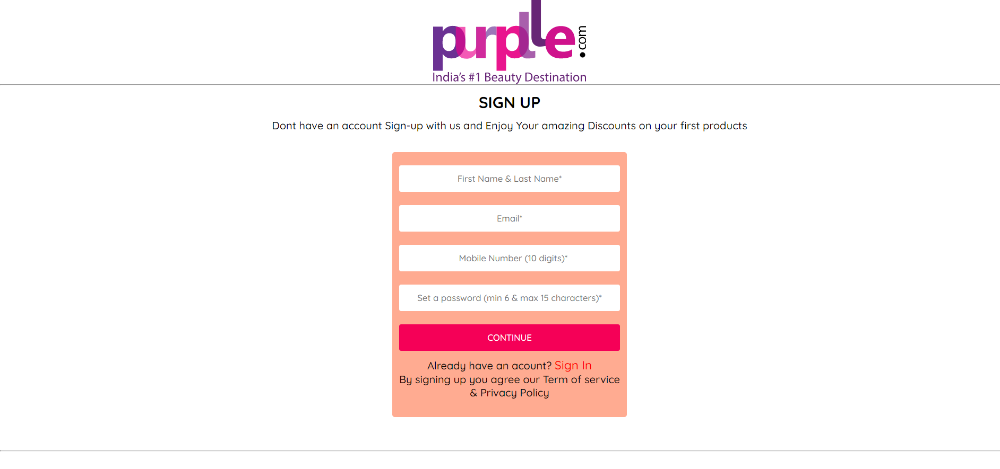
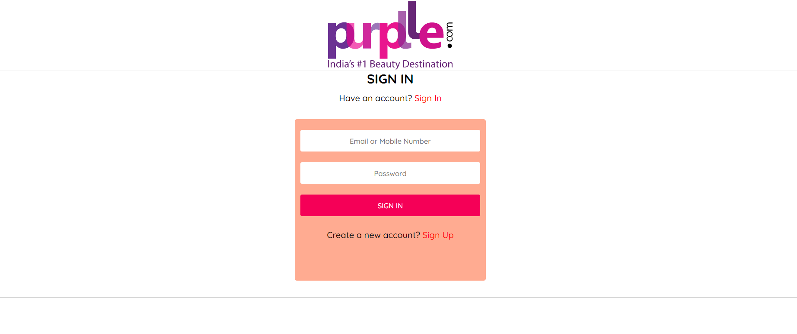
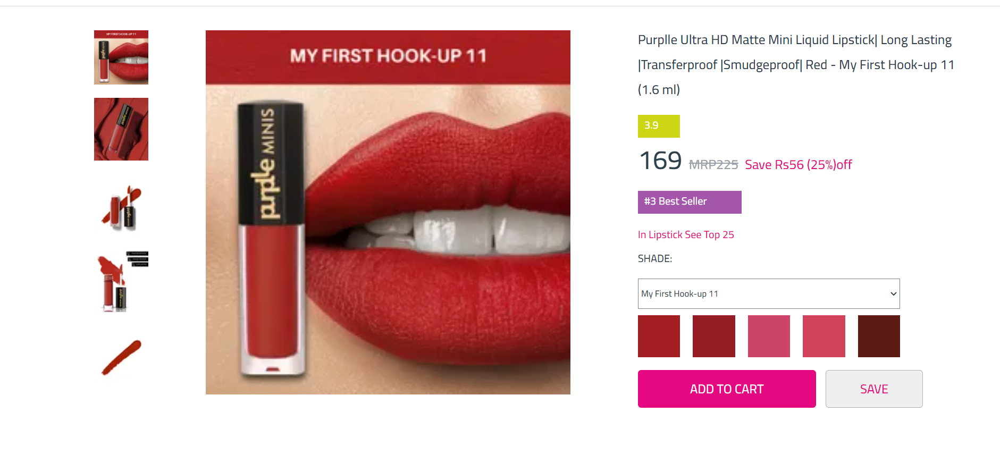
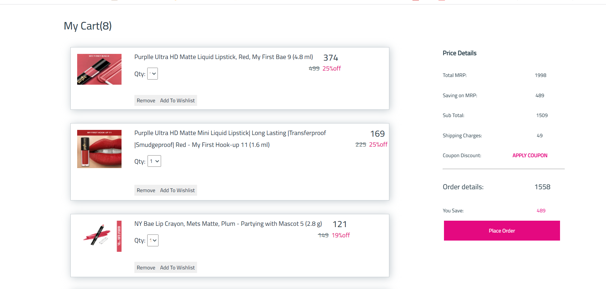
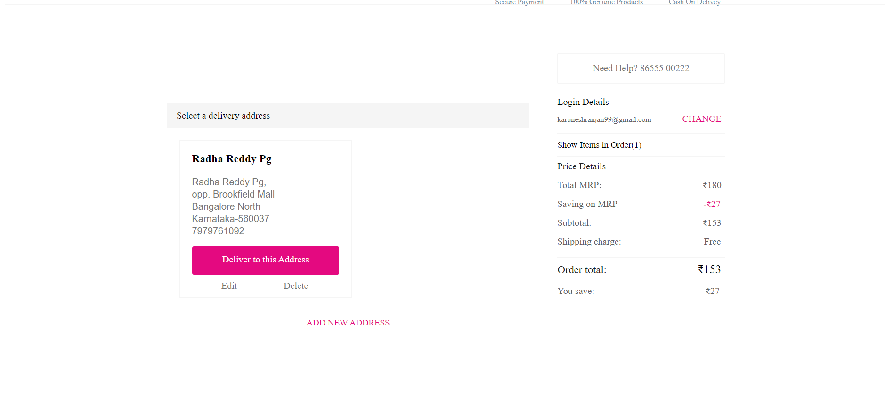
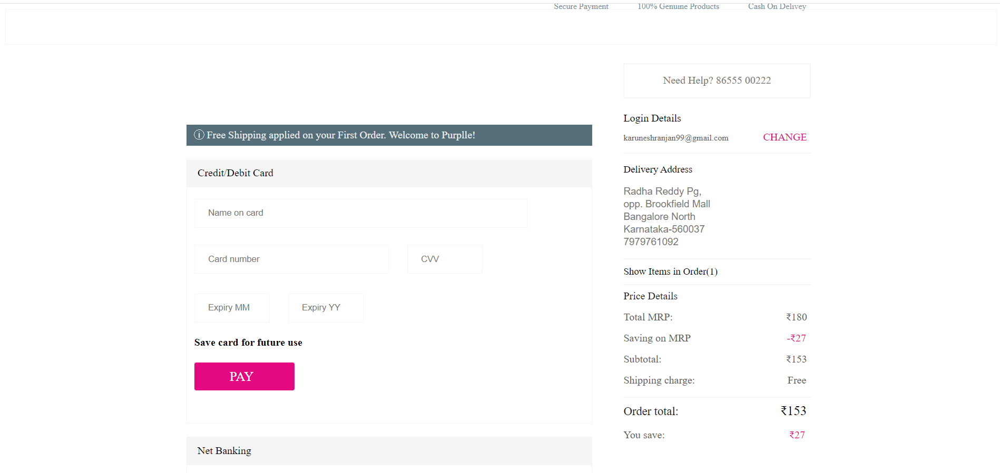
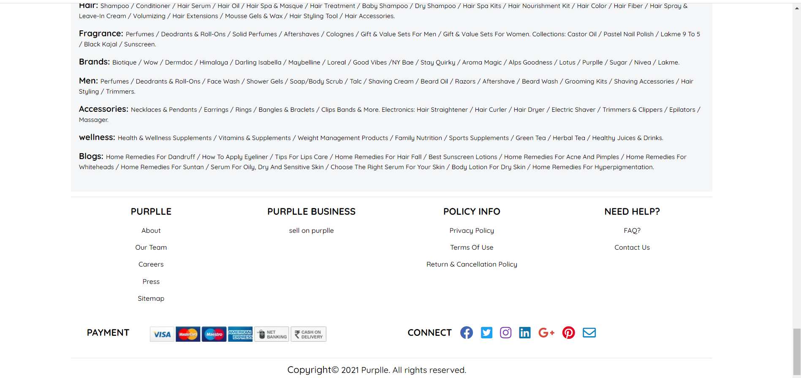

---
# Purpple Online Store Clone
---

---
# Welcome :wave:
---
### About Purplle:
> Meet Purplle,India's No.1 Beauty DestiNation! A powerful concoction of technology and beauty. A portal which delivers the best of both the worlds.Makeup has been around for over a hundred thousand years, and beauty is only evolving. What started with red
pigment clay is now a fascinating world of foundation, rouge, lipstick, blush, mascara, eye shadow, eye liner, eye
caramba!

#### Demo Deployed link:
- **[Checkout this deployed link](https://purplle-web-clone.netlify.app/)**
---

### Our Team Members :heart:

- **[Mahboob Asraf](https://github.com/MOHAMMADM-ASRAF)**
- **[Shweta Mane](https://github.com/ShwetaMane13)**
- **[Karunesh Ranjan](https://github.com/Karu555)**
- **[Shivam Sharma](https://github.com/Shivamkakda)**
- **[Rishab Bansal](https://github.com/rishab-bansal1)**

---

### Pages & Features :point_down:

- `Home Page`: Carousel Slider using setTimeout.
- `Sign-Up Page`: User details stored to local storage.
- `Sign-In Page`: User authentication to check whether user email and password is valid with details existing in the database.
- `Product Category Page`: Products created dynamically, with sorting and filtering features. Used event listener to dynamically change the image on hover.
- `Cart Page`: User can see or remove products added in the cart.
- `Wishlist Page`: Users can add or remove products to the wishlist.
- `Checkout Page`: Users can add the delivery address.
- `Payment Page`: Users can add their payment details and also avail for discount.
- `Order Processing Page` : setTimout to emulate original payment flow.
- `Order Successful Page` : cart gets empty automatically in local storage, once the user lands on this page.
- `Additional Features` : Kept the branding, fonts, colors and favicon and titles consistent throughtout the whole site to give a feel like the original site.

---

### How To Use ✅

First you have  to go to the signup page and create a new account. Then you will be redirected to the signIn page, where you will have to Enter Your Previous Signup Details For Further Process. Use that to complete the signup process. After the signup process is completed user details are added to the local storage.After clicking SignIn page User will redirect to products Page You can now go through the products page and navigate to add products to the cart. After that you can proceed to the checkout page. If you are not signed in you will be redirected to the signin page where you should use the same details you used during the signup proces. Otherwise you will not be able to signup. After signin you can go to the checkout page and add your address and proceed to payment page to add your debit/credit card details to place your order successfully.

---

### Tech Stack Used :wrench:

- `HTML`
- `CSS`
- `JavaScript`
- `Advanced JavaScript`
- `Material UI Colors`

---
### Tools Used 🔧
### Screenshots :camera:
- `Github`
- `vsCode`
- `Whatsupp`
---
- **Home Page**

---
- **Navbar UI**

---
- **Navbar UI 2**

---
- **Sign-Up Page**

---
- **Sign-In Page**

---
- **Product Category Page**

---

- **Product Details Page**

---
- **Cart Page**

---

- **Checkout Page**

---
- **Payment Page**

---

- **Footer Section**

---
<h3 align="center">Thank You! For Your Time :smiley:</h3>
